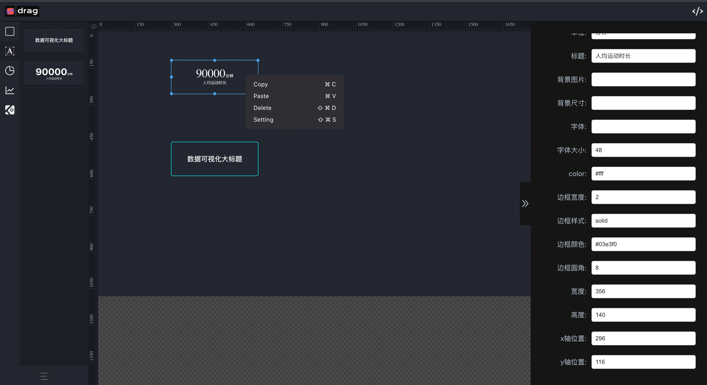

# react-visual-components

## Getting Started

Install

```bash
$ npm i react-visual-components
```

Ruler Demo

```jsx
import React from "react";
import { Ruler } from "react-visual-components";

// horizontal ruler
export default () => <Ruler width={600} height={20} direction="horizontal" />;
// vertical ruler
export default () => <Ruler width={20} height={600} direction="vertical" />;
```

Contextmenu Demo

```jsx
import React from "react";
import { Contextmenu } from "react-visual-components";

export default () => {
  const menus = [
    {
      label: "Copy",
      key: ["⌘", "C"],
    },
    {
      label: "Paste",
      key: ["⌘", "V"],
    },
    {
      label: "Delete",
      key: ["⇧", "⌘", "D"],
      command: () => console.log("Delete"),
    },
    {
      label: "Setting",
      key: ["⇧", "⌘", "S"],
      command: () => console.log("Delete"),
    },
  ];

  return <Contextmenu targetId="container" menus={menus} />;
};
```

Example



Experience

[https://iamwjun.github.io/](https://iamwjun.github.io/)
